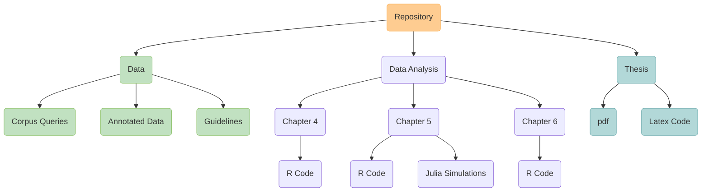

<h1 align="center">PhD Thesis  Mood alternations: a synchronic and diachronic study of negated complement clauses</h1>

<em>Raquel Montero Estebaranz</em>

### About this repository

This repository contains my PhD Thesis, which was written between the years 2020-2024 at the University of Konstanz under the supervision of George Walkden and Maribel Romero (mentor: Henri Kauhanen), as well as the data and code I used.  

#### Structure of the Repository

The repository is divided into three main folders: 
1. **Thesis**: contains the thesis itself.
2. **Data**: contains the (annotated) data to study the diachronic behaviour of mood selection, information on the queries run to extract the data from the CDH corpus and the annotation guidelines that were followed.
3. **Data Analysis**: R and Julia code used to analyze the data and run simulations.

### Corpora
 
-  *Corpus del Diccionario histórico de la lengua española*: most of the data used was extracted from the CDH. I would like to thank the creators for their work and for making this resource freely available for research.
  
    Real Academia Española (2013): *Corpus del Diccionario histórico de la lengua española (CDH)* [en linea]. <https://apps.rae.es/CNDHE>

### Other Resources
The materials in this thesis have greatly benefited from a number of free sofware resources, which I would also like to acknowledge.

-   $\LaTeX$: for typesetting the thesis.
-   R: for the statistical analysis.
-  Krita: for the images/diagrams (and for making my life happier in general :blush:).
