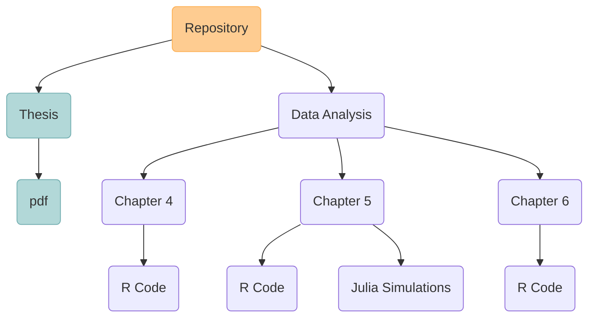

<h1 align="center">PhD Thesis</h2>

<em>Raquel Montero Estebaranz</em>

### About this repository

Here comes the information about the repository the thesis and the date of submission.
Structure of the Repository

The Folder data analysis contains the data from the three core chapters of the chapters of the thesis (the rest of chapters are theory based).

### Resources
The materials in this thesis have greatly benefited from a number of free sofware resources, which I would like to acknowledge.

- $\LaTeX$: for typesetting the thesis
- 
R: for the statistical analysis
- Krita: for drawings and paintings
