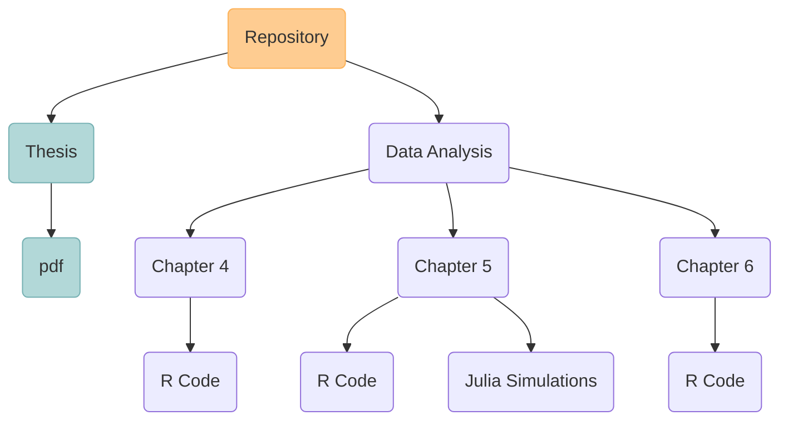

<h1 align="center">PhD Thesis</h2>

Raquel Montero Estebaranz

<!-- TABLE OF CONTENTS -->

  
Table of Contents

  <ol>
    <li>
      <a href="#about-the-project">About The Project</a>
      <ul>
        <li><a href="#built-with">Built With</a></li>
      </ul>
    </li>
    <li>
      <a href="#getting-started">Getting Started</a>
      <ul>
        <li><a href="#prerequisites">Prerequisites</a></li>
        <li><a href="#installation">Installation</a></li>
      </ul>
    </li>
    <li><a href="#contributing">Contributing</a></li>
    <li><a href="#contact">Contact</a></li>
    <li><a href="#acknowledgments">Acknowledgments</a></li>
  </ol>

### About this repository

Here comes the information about the repository the thesis and the date of submission.
Structure of the Repository

The Folder data analysis contains the data from the three core chapters of the chapters of the thesis (the rest of chapters are theory based).
