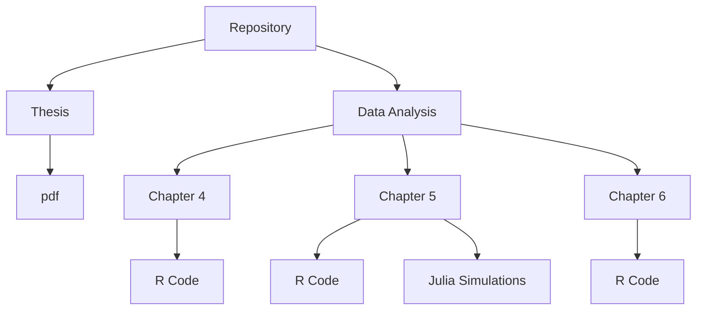

# PhD Thesis

- Here comes the description.
- ${\color{lightblue}Thesis}$

```mermaid
graph TD;
    A[Repository] -->B[Thesis];
    B[Thesis] -->B1[pdf];
    A[Repository]-->C[Data Analysis];
    C[Data Analysis] --> D[Chapter 4];
    D[Chapter 4] --> D1[R Code];
    C[Data Analysis] --> E[Chapter 5];
    E[Chapter 5] --> E1[R Code];
    E[Chapter 5] --> E2[Julia Simulations];
    C[Data Analysis] --> F[Chapter 6];
    F[Chapter 6] --> F1[R Code];
```
